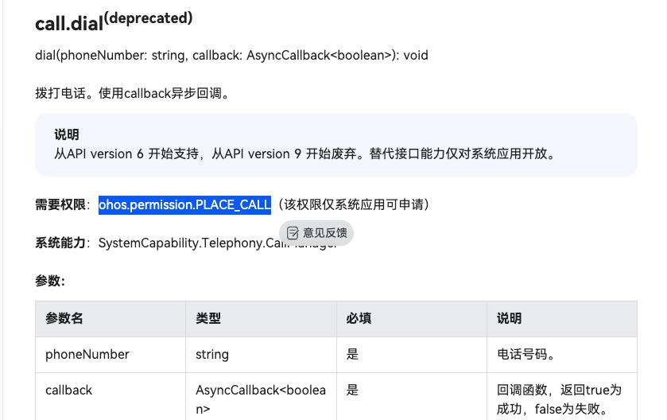

# 鸿蒙平台上 makePhoneCall 添加权限后报错
> uniapp-bugs https://github.com/GRCmade/uniapp-bugs

# 问题
用户反馈，拨打电话的接口调用后，失效
权限修改不正确
在华为官网中： https://developer.huawei.com/consumer/cn/doc/harmonyos-references-V13/js-apis-call-V13#calldialdeprecated 
显示需要一个权限：ohos.permission.PLACE_CALL

但是这个权限经过实际的测试发现
- 加上权限之后，提示没有签名权限
- 不加权限，是正常执行

# 过程

