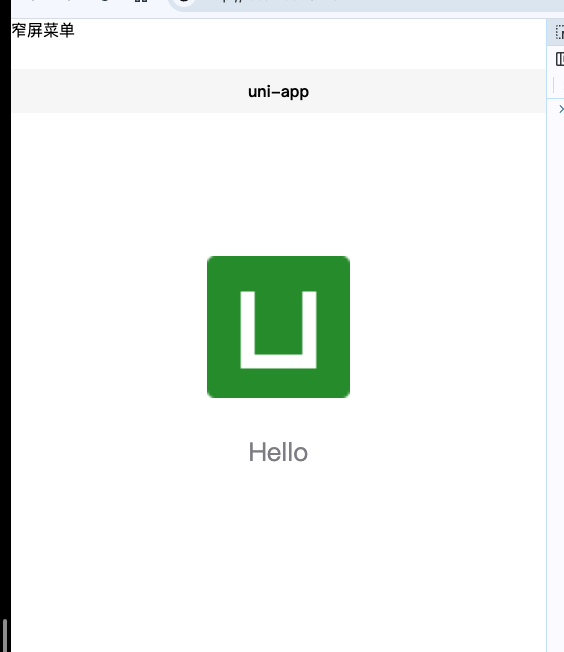
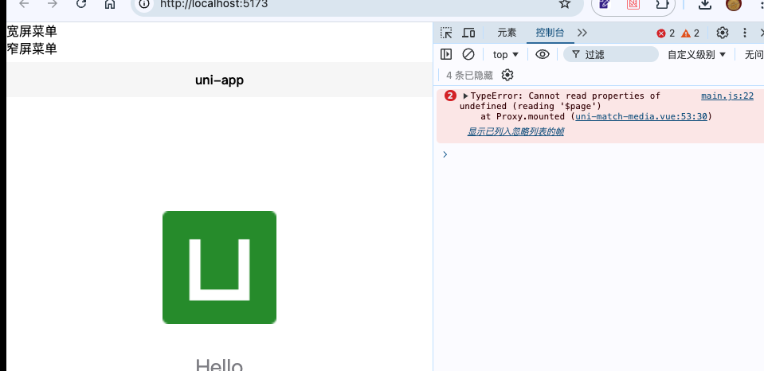

# cli 模板

cli 模板


# 说明
> 出现问题平台：H5

在 4.29 版本中 match-media 的代码如下所示：

```vue
  mounted () {
    mediaQueryObserver = uni.createMediaQueryObserver(this)
    mediaQueryObserver.observe({
      width: this.width,
      maxWidth: this.maxWidth,
      minWidth: this.minWidth,
      height: this.height,
      minHeight: this.minHeight,
      maxHeight: this.maxHeight,
      orientation: this.orientation
    }, matches => {
      this.matches = matches
    })
  },
```

在 4.36 的代码变为了：

```vue
  mounted () {
    let parent = this.$parent
    while (parent.$parent) {
        parent = parent.$parent
    }
    mediaQueryObserver = uni.createMediaQueryObserver(parent)
    mediaQueryObserver.observe({
      width: this.width,
      maxWidth: this.maxWidth,
      minWidth: this.minWidth,
      height: this.height,
      minHeight: this.minHeight,
      maxHeight: this.maxHeight,
      orientation: this.orientation
    }, matches => {
      this.matches = matches
    })
  },
```

this 的指向，变为了 this.$parent 
导致在之后的版本中，`<uni-match-media>` 这个组件无法使用

测试项目在 4.29 的效果


测试项目在 4.44 的效果


报错内容：
```
2main.js:22 TypeError: Cannot read properties of undefined (reading '$page')
    at new ServiceMediaQueryObserver (uni-h5.es.js:4701:30)
    at uni-h5.es.js:4737:10
    at Module.createMediaQueryObserver (uni-h5.es.js:3075:15)
    at Proxy.mounted (uni-match-media.vue:53:30)
```