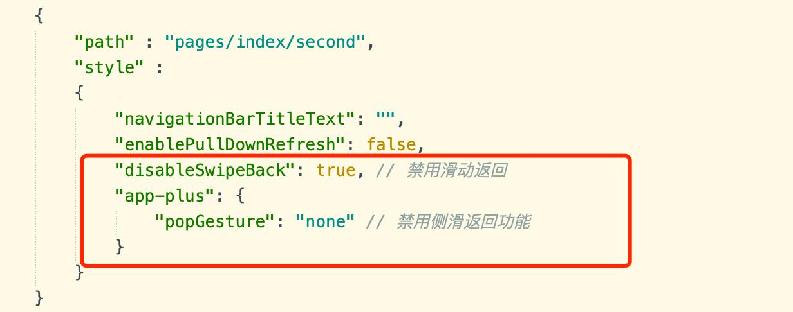
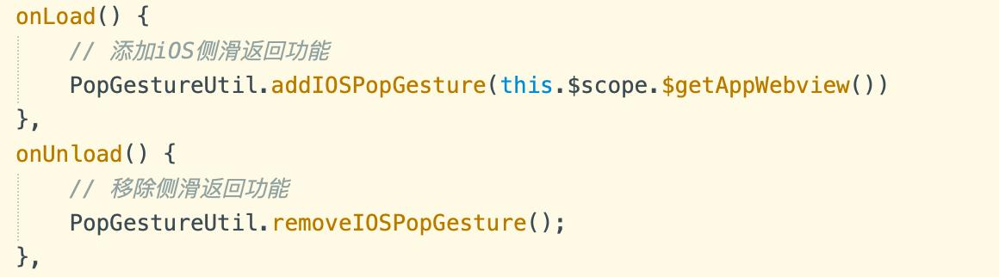

# ay-pop-gesture
## 使用文档
### 1.将插件导入项目中
### 2.在pages.json文件中禁用webview所在vue页的侧滑返回功能
 
### 3. webview所在vue页引入插件
```
import PopGestureUtil from '@/uni_modules/ay-pop-gesture/js_sdk/ay-pop-gesture.js'
```

### 4.在页面的onLoad和onUnload方法引入对应的方法

```
onLoad() {
	// 添加iOS侧滑返回功能
	PopGestureUtil.addIOSPopGesture(this.$scope.$getAppWebview());
},
```
```
onUnload() {
	// 移除侧滑返回功能
	PopGestureUtil.removeIOSPopGesture();
},
```
### 5.插件至此集成完成，运行到真机测试